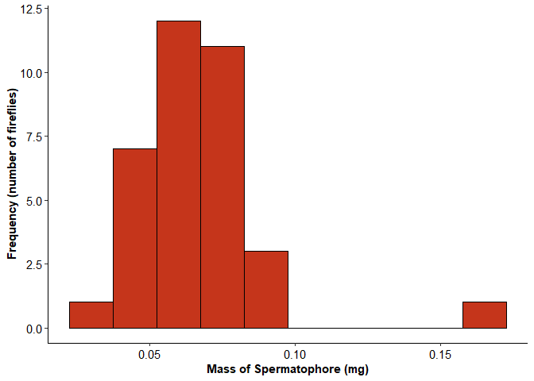
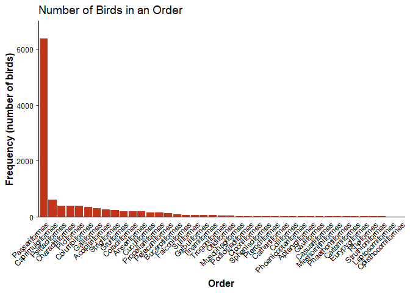

Lab 3 Report
================
Beau Ayers
2021-01-28

Instructions for this lab report can be found on [Your assignment
section of Lab Assignment 3 Introduction to
ggplot2](https://biol275-msum.github.io/introduction-to-ggplot2.html#your-assignment)
on the lab website.

## Fireflies

> A. Insert an R code chunk and create a graph depicting the frequency
> distribution of the 35 mass measurements. It should have legible text
> and appropriate axis labels.

``` r
library(tidyverse)
```

    ## -- Attaching packages --------------------------------------- tidyverse 1.3.0 --

    ## v ggplot2 3.3.3     v purrr   0.3.4
    ## v tibble  3.0.4     v dplyr   1.0.2
    ## v tidyr   1.1.2     v stringr 1.4.0
    ## v readr   1.4.0     v forcats 0.5.0

    ## -- Conflicts ------------------------------------------ tidyverse_conflicts() --
    ## x dplyr::filter() masks stats::filter()
    ## x dplyr::lag()    masks stats::lag()

``` r
firefly_data <- read_csv("https://whitlockschluter.zoology.ubc.ca/wp-content/data/chapter02/chap02q19FireflySpermatophoreMass.csv")
```

    ## 
    ## -- Column specification --------------------------------------------------------
    ## cols(
    ##   spermatophoreMass = col_double()
    ## )

``` r
firefly_data
```

    ## # A tibble: 35 x 1
    ##    spermatophoreMass
    ##                <dbl>
    ##  1             0.047
    ##  2             0.037
    ##  3             0.041
    ##  4             0.045
    ##  5             0.039
    ##  6             0.064
    ##  7             0.064
    ##  8             0.065
    ##  9             0.079
    ## 10             0.07 
    ## # ... with 25 more rows

``` r
# A tibble: 35 x 1
#> spermatophoreMass
#> <dbl>
#> 1             0.047
#> 2             0.037
#> 3             0.041
#> 4             0.045
#> 5             0.039
#> 6             0.064
#> 7             0.064
#> 8             0.065
#> 9             0.079
#> 10             0.07 
# ... with 25 more rows

ggplot(data = firefly_data) +
  geom_histogram(mapping = aes(x = spermatophoreMass), binwidth = 0.005,
                 fill = "#C5351B", color = "black") +
  labs(x = "Mass of Spermatophore (mg)", y = "Frequency (number of fireflies)") +
  theme_classic() +
  theme(
    axis.title = element_text(face = "bold"),
    axis.text = element_text(color = "black", size = rel(1))
  )
```

<!-- -->

> B. What type of graph did you choose in part (A)? Why?

I chose a histogram. My reasoning for this is the data is numerical not
categorical.

> C. Describe the shape of the frequency distribution. What are its main
> features?

The graph is skewed to the right.

> D. What term would be used to describe the largest measurement in the
> frequency distribution? You can refer to the lecture slides, your
> notes, or the textbook.

The highest point or measurement would be the mode of the graph.

## Bird orders

I read the data using the code provided by the instructor. The dataset
is from the auk package and was originally named ebird\_taxonomy. I
converted it to a tibble, removed non-species taxa, and named the new
dataset birds.

``` r
library(auk)                          # load the auk package
```

    ## auk 0.4.2 is designed for EBD files downloaded after 2019-08-15. 
    ## No EBD data directory set, see ?auk_set_ebd_path to set EBD_PATH 
    ## eBird taxonomy version:  2019

``` r
birds <- ebird_taxonomy %>%           # start with the ebird_taxonomy data
  as_tibble() %>%                     # tibbles print better in the console
  filter(category == "species")       # remove non-species taxa
```

> E. How many bird species are in the new birds dataset? How did you
> find out?

10721. There are 10721 rows.

> H. How many orders are there? You can get this right by counting on
> the graph, but you will only get full points if you use some code to
> figure it out.

41 different Orders.

``` r
nrow(distinct(birds, order))
```

    ## [1] 41

> F. Insert an R code chunk and create a graph depicting the
> distribution of orders in the birds dataset. Sort the orders with the
> most frequent on the left. It should have legible text and appropriate
> axis labels.

``` r
library(auk)                          # load the auk package
birds <- ebird_taxonomy %>%           # start with the ebird_taxonomy data
  as_tibble() %>%                     # tibbles print better in the console
  filter(category == "species")       # remove non-species taxa

ggplot(data = birds) +
  geom_bar(mapping = aes(x = fct_infreq(order)), fill = "#C5351B") + 
  labs(x = "Order", y = "Frequency (number of birds)", 
       title = "Number of Birds in an Order") +
  scale_y_continuous(limits = c(0, 7000), expand = expansion(mult = 0)) +
  theme_classic(base_size = 12) +
  theme(
    axis.title = element_text(face = "bold"),
    axis.text = element_text(color = "black", size = rel(1)),
    axis.text.x = element_text(angle = 45, hjust = 1),
    axis.ticks.x = element_blank()
  )
```

<!-- -->

> G. What kind of graph did you create? Why?

I created a Bar Graph because the data in this section was categorical.

## Links to peer review

I reviewed MaryJo’s lab report at this URL:
<https://github.com/BIOL275-MSUM/lab-3-intro-to-ggplot-MaryJo-Nelson>

MaryJo reviewed my lab report at this URL:
<https://github.com/BIOL275-MSUM/lab-3-intro-to-ggplot-BeauAyers>

## Session Info

Here is my session information:

``` r
sessioninfo::session_info()
```

    ## - Session info ---------------------------------------------------------------
    ##  setting  value                       
    ##  version  R version 4.0.3 (2020-10-10)
    ##  os       Windows 10 x64              
    ##  system   x86_64, mingw32             
    ##  ui       RTerm                       
    ##  language (EN)                        
    ##  collate  English_United States.1252  
    ##  ctype    English_United States.1252  
    ##  tz       America/Chicago             
    ##  date     2021-01-28                  
    ## 
    ## - Packages -------------------------------------------------------------------
    ##  package     * version date       lib source        
    ##  assertthat    0.2.1   2019-03-21 [1] CRAN (R 4.0.3)
    ##  auk         * 0.4.3   2020-11-23 [1] CRAN (R 4.0.3)
    ##  backports     1.2.0   2020-11-02 [1] CRAN (R 4.0.3)
    ##  broom         0.7.3   2020-12-16 [1] CRAN (R 4.0.3)
    ##  cellranger    1.1.0   2016-07-27 [1] CRAN (R 4.0.3)
    ##  cli           2.2.0   2020-11-20 [1] CRAN (R 4.0.3)
    ##  colorspace    2.0-0   2020-11-11 [1] CRAN (R 4.0.3)
    ##  crayon        1.3.4   2017-09-16 [1] CRAN (R 4.0.3)
    ##  curl          4.3     2019-12-02 [1] CRAN (R 4.0.3)
    ##  DBI           1.1.0   2019-12-15 [1] CRAN (R 4.0.3)
    ##  dbplyr        2.0.0   2020-11-03 [1] CRAN (R 4.0.3)
    ##  digest        0.6.27  2020-10-24 [1] CRAN (R 4.0.3)
    ##  dplyr       * 1.0.2   2020-08-18 [1] CRAN (R 4.0.3)
    ##  ellipsis      0.3.1   2020-05-15 [1] CRAN (R 4.0.3)
    ##  evaluate      0.14    2019-05-28 [1] CRAN (R 4.0.3)
    ##  fansi         0.4.1   2020-01-08 [1] CRAN (R 4.0.3)
    ##  farver        2.0.3   2020-01-16 [1] CRAN (R 4.0.3)
    ##  forcats     * 0.5.0   2020-03-01 [1] CRAN (R 4.0.3)
    ##  fs            1.5.0   2020-07-31 [1] CRAN (R 4.0.3)
    ##  generics      0.1.0   2020-10-31 [1] CRAN (R 4.0.3)
    ##  ggplot2     * 3.3.3   2020-12-30 [1] CRAN (R 4.0.3)
    ##  glue          1.4.2   2020-08-27 [1] CRAN (R 4.0.3)
    ##  gtable        0.3.0   2019-03-25 [1] CRAN (R 4.0.3)
    ##  haven         2.3.1   2020-06-01 [1] CRAN (R 4.0.3)
    ##  hms           1.0.0   2021-01-13 [1] CRAN (R 4.0.3)
    ##  htmltools     0.5.0   2020-06-16 [1] CRAN (R 4.0.3)
    ##  httr          1.4.2   2020-07-20 [1] CRAN (R 4.0.3)
    ##  jsonlite      1.7.2   2020-12-09 [1] CRAN (R 4.0.3)
    ##  knitr         1.30    2020-09-22 [1] CRAN (R 4.0.3)
    ##  labeling      0.4.2   2020-10-20 [1] CRAN (R 4.0.3)
    ##  lifecycle     0.2.0   2020-03-06 [1] CRAN (R 4.0.3)
    ##  lubridate     1.7.9.2 2020-11-13 [1] CRAN (R 4.0.3)
    ##  magrittr      2.0.1   2020-11-17 [1] CRAN (R 4.0.3)
    ##  modelr        0.1.8   2020-05-19 [1] CRAN (R 4.0.3)
    ##  munsell       0.5.0   2018-06-12 [1] CRAN (R 4.0.3)
    ##  pillar        1.4.7   2020-11-20 [1] CRAN (R 4.0.3)
    ##  pkgconfig     2.0.3   2019-09-22 [1] CRAN (R 4.0.3)
    ##  purrr       * 0.3.4   2020-04-17 [1] CRAN (R 4.0.3)
    ##  R6            2.5.0   2020-10-28 [1] CRAN (R 4.0.3)
    ##  Rcpp          1.0.5   2020-07-06 [1] CRAN (R 4.0.3)
    ##  readr       * 1.4.0   2020-10-05 [1] CRAN (R 4.0.3)
    ##  readxl        1.3.1   2019-03-13 [1] CRAN (R 4.0.3)
    ##  reprex        0.3.0   2019-05-16 [1] CRAN (R 4.0.3)
    ##  rlang         0.4.10  2020-12-30 [1] CRAN (R 4.0.3)
    ##  rmarkdown     2.6     2020-12-14 [1] CRAN (R 4.0.3)
    ##  rstudioapi    0.13    2020-11-12 [1] CRAN (R 4.0.3)
    ##  rvest         0.3.6   2020-07-25 [1] CRAN (R 4.0.3)
    ##  scales        1.1.1   2020-05-11 [1] CRAN (R 4.0.3)
    ##  sessioninfo   1.1.1   2018-11-05 [1] CRAN (R 4.0.3)
    ##  stringi       1.5.3   2020-09-09 [1] CRAN (R 4.0.3)
    ##  stringr     * 1.4.0   2019-02-10 [1] CRAN (R 4.0.3)
    ##  tibble      * 3.0.4   2020-10-12 [1] CRAN (R 4.0.3)
    ##  tidyr       * 1.1.2   2020-08-27 [1] CRAN (R 4.0.3)
    ##  tidyselect    1.1.0   2020-05-11 [1] CRAN (R 4.0.3)
    ##  tidyverse   * 1.3.0   2019-11-21 [1] CRAN (R 4.0.3)
    ##  utf8          1.1.4   2018-05-24 [1] CRAN (R 4.0.3)
    ##  vctrs         0.3.6   2020-12-17 [1] CRAN (R 4.0.3)
    ##  withr         2.3.0   2020-09-22 [1] CRAN (R 4.0.3)
    ##  xfun          0.20    2021-01-06 [1] CRAN (R 4.0.3)
    ##  xml2          1.3.2   2020-04-23 [1] CRAN (R 4.0.3)
    ##  yaml          2.2.1   2020-02-01 [1] CRAN (R 4.0.3)
    ## 
    ## [1] C:/Users/Draco/Documents/R/win-library/4.0
    ## [2] C:/Program Files/R/R-4.0.3/library
